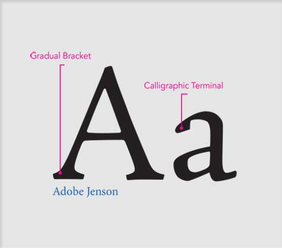
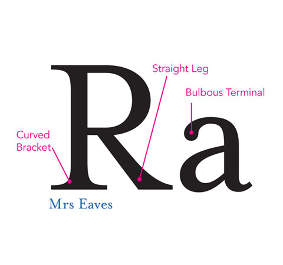
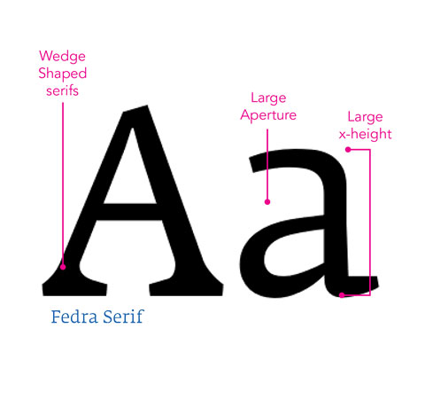
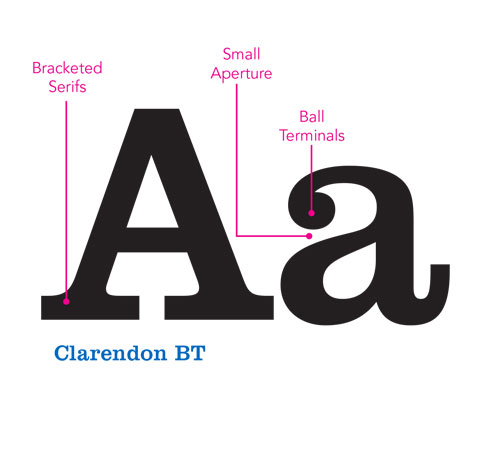
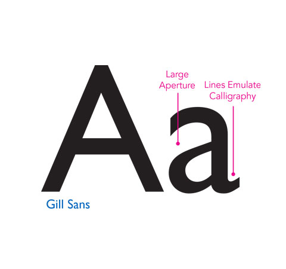
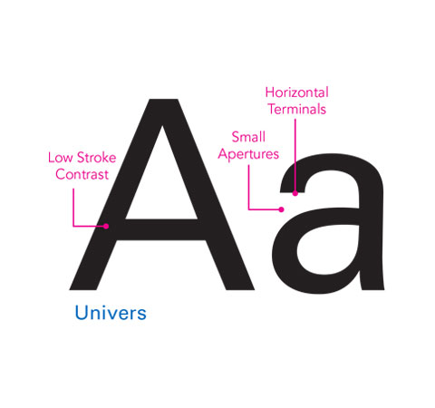
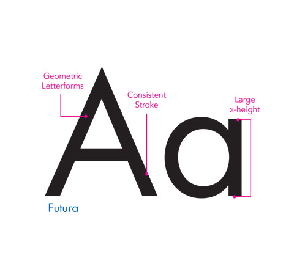
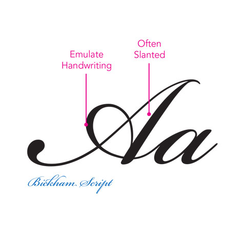

# No apps for old fonts
> Some tips to keep your typography consistent

## Fonts

### Serif

##### Humanist

- Contrasting strokes- Classic and traditional

*Great for journalism or historical applications*

##### Transitional

- Sharper serif
- Strong, stylish and dynamic
- Asymmetrical
- Heavy presence on the page
- Moderate stroke weight variations

*Great for traditional academic and legal applications*

##### Modern

- Thin horizontal serif
- More contrasting strokes
- Structure clear and elegant
- Appropriate for easy, skimming reading
	
*Great for arts and culture applications*

##### Slab

- Heavy boxy serifs
- Very low contrast stroke
- Authoritative, yet friendly
- Ball terminals
- Typically bold structure
- Decorative, eye-catching typeface

*Great for marketing and promotional applications*

### Sans-serif

##### Humanist

- Contrasting strokes
- Transition between the perfect and the imperfect
- Contrast in strokes for a sans serif

*Great for government or educational applications*

##### Transitional

- Strong strokes
- Upright, uniform characters
- Unassuming and modern fill
- Modernized Grotesque style
- Ideal for display text
- Small apertures

*Great for technology and transportation applications*

##### Geometric

- Geometric shapes form the backbones of the letters
- Strict, objective and universal feel
- Consistent stroke
- Simple and consistent letter shape
- Geometric letter forms, appear to be created from squares and circles

*Great for science or architectural application*

### Script

- Great for adding a human element to the website
- Not so great for body text, is difficulty to ready
- Strokes reminiscent of pen or paint brush
- Often slanted

## Typeface Mixing

1. Don't choose two fonts from the same style (humanist, geometric, etc).
2. Don't choose two fonts from the same class (serif, sans-serif).

*Choose fonts that share one thing in common but are otherwise different, like humanist serif and humanist sans.
And that trait can even be largely abstract, like a transitional serif and a humanist sans*

All in all, you should strive for contrast over harmony. A good rule to thumb to follow, when mixing typefaces is keep it the same or change a lot, look for emphatic differences rather than mushy transitions.

Don't feel obligated to pick two fonts for your project, a simple typeface is often enough. And this for beginner is the ideal, you can practice and learn more using different weights before try to incorporate many others typefaces.

## Sizes

*A good size is 16px.*
*The headline can be anywhere from 200% to 300%.*

### Leading
- Leading too large negatively affects readability, as the eye has to move further between the lines of text, and can easily get lost.
- Leading that is too small can create a cramped or claustrophobic fell that rushes the reader.

*Good leading is around 120 and 150% of the body copy size.*

### Line width
*Keep 50 to 70 characters per line including spaces id ideal.*

- - -

Here's a table with whats size i'm using
#### Body
|Size|Font Size|Line Height|Characters|
|--           |---|---|---|
|Print        | 12pt       | 1.25em  | 60-75 |
|Desktop (lg) | 1em (16px) | 1.375em | 60-75 |
|Desktop      | 1em (16px) | 1.375em | 60-75 |
|Tablet (lg)  | 1em (16px) | 1.375em | 60-75 |
|Tablet (sm)  | 1em (16px) | 1.25em  | 60-75 |
|Phone        | 1em (16px) | 1.25em  | 35-40 |

#### H1
|Size|Font Size|Line Height|
|--           |---|---|---|
|Print        | 36pt         | 1.25em  |
|Desktop (lg) | 3em (48px)   | 1.05em  |
|Desktop      | 3em (48px)   | 1.05em  |
|Tablet (lg)  | 2.5em (40px) | 1.125em |
|Tablet (sm)  | 2em (32px)   | 1.25em  |
|Phone        | 2em (32px)   | 1.25em  |

#### H2
|Size|Font Size|Line Height|
|--           |---|---|---|
|Print        | 24pt            | 1.25em       |
|Desktop (lg) | 2.25em (36px)   | 1.25em       |
|Desktop      | 2.25em (36px)   | 1.25em       |
|Tablet (lg)  | 2em (32px)      | 1.25em 			 |
|Tablet (sm)  | 1.625em (26px)  | 1.15384615em |
|Phone        | 1.625em (26px)  | 1.15384615em |

#### H3
|Size|Font Size|Line Height|
|--           |---|---|---|
|Print        | 18pt           | 1.25em  			|
|Desktop (lg) | 1.75em (28px)  | 1.25em  			|
|Desktop      | 1.75em (28px)  | 1.25em  			|
|Tablet (lg)  | 1.5em (24px)   | 1.25em       |
|Tablet (sm)  | 1.375em (22px) | 1.13636364em |
|Phone        | 1.375em (22px) | 1.13636364em |

#### H4
|Size|Font Size|Line Height|
|--           |---|---|---|
|Print        | 14pt             | 1.25em  			|
|Desktop (lg) | 1.125em (18px)   | 1.22222222em |
|Desktop      | 1.125em (18px)   | 1.22222222em |
|Tablet (lg)  | 1.125em (18px)   | 1.22222222em |
|Tablet (sm)  | 1.125em (18px)   | 1.11111111em |
|Phone        | 1.125em (18px)   | 1.11111111em |

#### Bloquote
|Size|Font Size|Line Height|
|--           |---|---|---|
|Print        | 24pt           | 1.45833333em |
|Desktop (lg) | 1.5em (24px)   | 1.45833333em |
|Desktop      | 1.5em (24px)   | 1.45833333em |
|Tablet (lg)  | 1.5em (24px)   | 1.45833333em |
|Tablet (sm)  | 1.25em (20px)  | 1.25em       |
|Phone        | 1.25em (20px)  | 1.25em       |

## Weights

- Using too much bold can muddy your hierarchy.
- Make sure the bold and italic complement the default value.

## Tools and further reading

- [Typecast](http://typecast.com)
- [Vertical Rhythm](http://typecast.com/blog/4-simple-steps-to-vertical-rhythm)
- [Modular Scale](http://alistapart.com/article/more-meaningful-typography)

## Credits
- [Size's table](http://typecast.com/blog/a-more-modern-scale-for-web-typography)
- [Images](http://designerscultureguide.com/typeface/)

## Why this name?
My repositories's name are inspired in movies's name.

## License
[MIT](LICENSE.md) © Filipe LInhares
